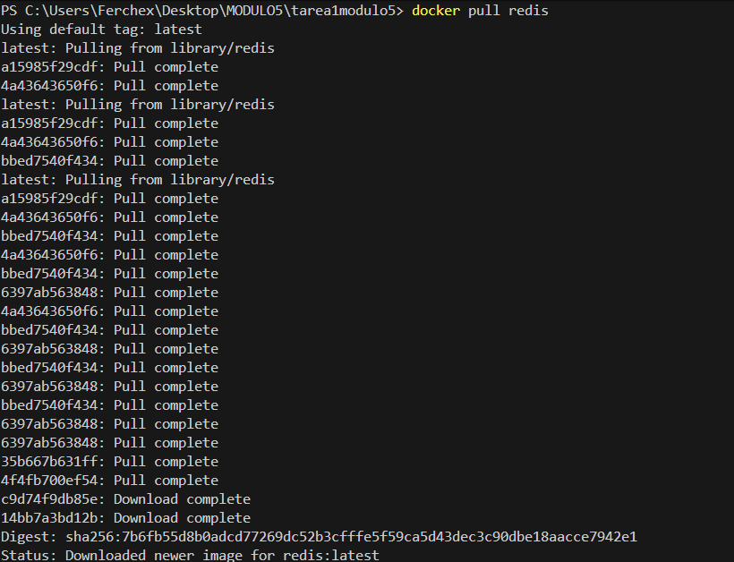

# Práctica: Gestión de Contenedores con Docker

## 📌 Objetivo

Descargar y ejecutar tres contenedores diferentes utilizando imágenes oficiales de Docker Hub, documentar los comandos utilizados y evidenciar el proceso mediante capturas de pantalla.

---

# 1️⃣ Verificación de Docker

Se verificó que Docker estuviera correctamente instalado y funcionando.

📷 Evidencia:

---

# 2️⃣ Descarga de Imágenes (Pull)

## 🔹 PostgreSQL
docker pull postgres

📷 Evidencia:

---

## 🔹 MariaDB
docker pull mariadb

📷 Evidencia:

---

## 🔹 Redis
docker pull redis
📷 Evidencia:

---

# 3️⃣ Verificación de Imágenes Descargadas

docker images

📷 Evidencia:

---

# 4️⃣ Ejecución de Contenedores (Run)

## 🔹 PostgreSQL
docker run -d --name contenedor-postgres -e POSTGRES_PASSWORD=123456 -p 5432:5432 postgres

📷 Evidencia:

---

## 🔹 MariaDB
docker run -d --name contenedor-mariadb -e MARIADB_ROOT_PASSWORD=123456 -p 3306:3306 mariadb

📷 Evidencia:

---

## 🔹 Redis
docker run -d --name contenedor-redis -p 6379:6379 redis

📷 Evidencia:

---

# 5️⃣ Verificación de Contenedores en Ejecución

docker ps

📷 Evidencia:

---

# 6️⃣ Prueba de Conexión a PostgreSQL

Se realizó una prueba de conexión al contenedor de PostgreSQL para verificar su correcto funcionamiento.

La conexión se realizó utilizando el usuario `postgres` y la contraseña definida en el momento de ejecutar el contenedor.

📷 Evidencia:

---

# 7️⃣ Verificación de Todos los Contenedores

docker ps -a

📷 Evidencia:

---

# 8️⃣ Detención de Contenedores

docker stop 22b  
docker stop a7e  
docker stop 7eb  

📷 Evidencia:

---

# 9️⃣ Eliminación de Contenedores

docker rm 22b  
docker rm a7e  
docker rm 7eb  

📷 Evidencia:

---

# 🔟 Eliminación de Imágenes

docker rmi postgres  
docker rmi mariadb  
docker rmi redis  

📷 Evidencia:

---

# 🔎 Descripción de los Contenedores

### PostgreSQL
Sistema gestor de base de datos relacional de código abierto utilizado para almacenamiento estructurado de información.

### MariaDB
Sistema gestor de base de datos relacional derivado de MySQL, ampliamente utilizado en aplicaciones web.

### Redis
Base de datos en memoria orientada a clave-valor utilizada principalmente como sistema de caché.

---

# ✅ Conclusión

Se descargaron, ejecutaron y verificaron correctamente tres contenedores utilizando imágenes oficiales de Docker Hub.  
Se comprobó la conectividad a PostgreSQL y posteriormente se detuvieron y eliminaron tanto los contenedores como las imágenes.