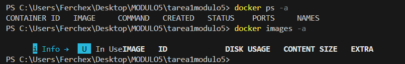
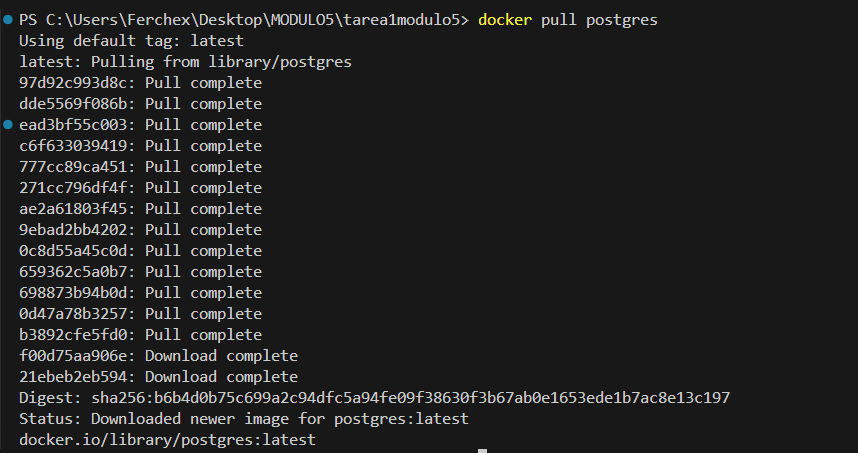
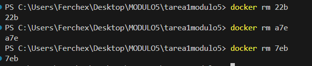

# Práctica: Gestión de Contenedores con Docker

## 📌 Objetivo

Descargar y ejecutar tres contenedores diferentes utilizando imágenes oficiales de Docker Hub, documentar los comandos utilizados y evidenciar el proceso mediante capturas de pantalla.

---

# 1️⃣ Verificación de Docker

Antes de comenzar, se verificó que Docker estuviera correctamente instalado y funcionando en el sistema.

📷 Evidencia:

---

# 2️⃣ Descarga de Imágenes (Pull)

Se descargaron imágenes oficiales desde Docker Hub:

## 🔹 PostgreSQL

docker pull postgres

📷 Evidencia:

---

## 🔹 MariaDB

docker pull mariadb

📷 Evidencia:

---

## 🔹 Redis

docker pull redis

---

# 3️⃣ Verificación de Imágenes Descargadas

docker images

📷 Evidencia:

---

# 4️⃣ Ejecución de Contenedores (Run)

## 🔹 PostgreSQL

docker run -d --name contenedor-postgres -e POSTGRES_PASSWORD=123456 -p 5432:5432 postgres

📷 Evidencia:

---

## 🔹 MariaDB

docker run -d --name contenedor-mariadb -e MARIADB_ROOT_PASSWORD=123456 -p 3306:3306 mariadb

📷 Evidencia:

---

## 🔹 Redis

docker run -d --name contenedor-redis -p 6379:6379 redis

📷 Evidencia:

---

# 5️⃣ Verificación de Contenedores en Ejecución

docker ps

📷 Evidencia:

---

# 6️⃣ Verificación de Todos los Contenedores

docker ps -a

📷 Evidencia:

---

# 7️⃣ Detención de Contenedores

Se detuvieron los contenedores utilizando las primeras tres letras del ID:

docker stop 22b  
docker stop a7e  
docker stop 7eb  

📷 Evidencia:

---

# 8️⃣ Eliminación de Contenedores

docker rm 22b  
docker rm a7e  
docker rm 7eb  

📷 Evidencia:

---

# 9️⃣ Eliminación de Imágenes

docker rmi postgres  
docker rmi mariadb  
docker rmi redis  

📷 Evidencia:

---

# 🔎 Descripción de los Contenedores Utilizados

### PostgreSQL
Sistema de gestión de bases de datos relacional de código abierto, ampliamente utilizado en aplicaciones empresariales.

### MariaDB
Sistema gestor de bases de datos relacional derivado de MySQL, utilizado en aplicaciones web y servidores.

### Redis
Base de datos en memoria orientada a clave-valor, utilizada principalmente como sistema de caché y almacenamiento rápido.

---

# ✅ Conclusión

Se logró descargar, ejecutar, verificar, detener y eliminar correctamente tres contenedores utilizando imágenes oficiales de Docker Hub.  
Las capturas demuestran el funcionamiento adecuado de cada etapa del proceso.