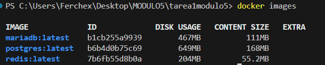
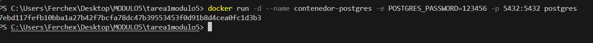
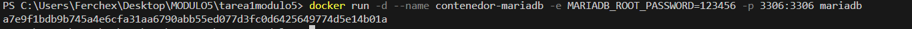
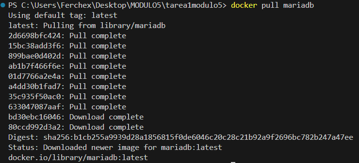
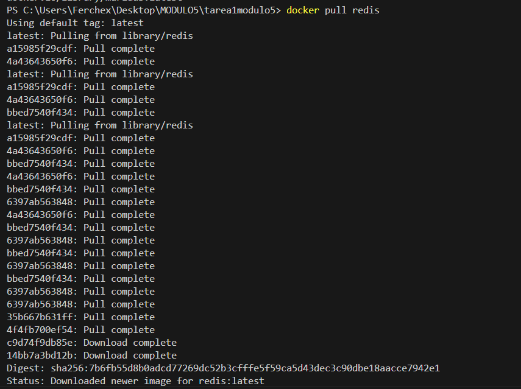
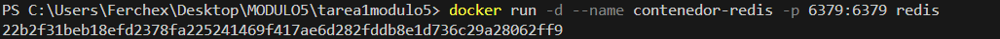
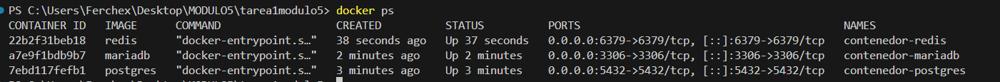
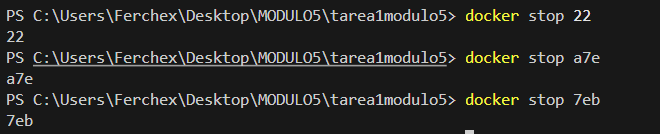
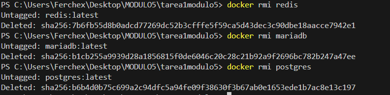

# Práctica: Gestión de Contenedores con Docker

## 📌 Objetivo

Descargar y ejecutar tres contenedores diferentes utilizando imágenes oficiales de Docker Hub, documentar los comandos utilizados y mostrar evidencia mediante capturas de pantalla.

---

## 🐳 Imágenes utilizadas

Se utilizaron imágenes oficiales de:

- PostgreSQL
- MariaDB
- Redis

---

## ⬇️ 1. Descarga de Imágenes

Se descargaron las imágenes oficiales desde Docker Hub utilizando los siguientes comandos:

docker pull postgres  
docker pull mariadb  
docker pull redis  

📷 Evidencia:
- 

---

## 🚀 2. Ejecución de Contenedores

### 🔹 PostgreSQL

docker run -d --name contenedor-postgres -e POSTGRES_PASSWORD=123456 -p 5432:5432 postgres

Explicación:
- `-d` ejecuta el contenedor en segundo plano.
- `--name` asigna un nombre personalizado.
- `-e POSTGRES_PASSWORD` define la contraseña del usuario postgres.
- `-p 5432:5432` expone el puerto del contenedor al host.

📷 Evidencia:

---

### 🔹 MariaDB

docker run -d --name contenedor-mariadb -e MARIADB_ROOT_PASSWORD=123456 -p 3306:3306 mariadb

Explicación:
- Se define la contraseña del usuario root.
- Se expone el puerto 3306 para conexiones externas.

📷 Evidencia:

---

### 🔹 Redis

docker run -d --name contenedor-redis -p 6379:6379 redis

Explicación:
- Redis se ejecuta en segundo plano.
- Se expone el puerto 6379.

📷 Evidencia:

---

## 📋 3. Verificación de Contenedores

Para verificar que los contenedores estaban en ejecución se utilizaron los siguientes comandos:

docker ps  
docker ps -a  

📷 Evidencia:

También se verificó la conexión a la base de datos.

📷 Evidencia:

---

## 🛑 4. Detención de Contenedores

Se detuvieron los contenedores utilizando las primeras tres letras del ID:

docker stop 22b  
docker stop a7e  
docker stop 7eb  

📷 Evidencia:

---

## 🗑 5. Eliminación de Contenedores

docker rm 22b  
docker rm a7e  
docker rm 7eb  

📷 Evidencia:

---

## 🧹 6. Eliminación de Imágenes

docker rmi postgres  
docker rmi mariadb  
docker rmi redis  

📷 Evidencia:

---

## 📖 Descripción de cada Contenedor

PostgreSQL:  
Sistema gestor de base de datos relacional de código abierto, utilizado para almacenamiento estructurado de información.

MariaDB:  
Sistema gestor de base de datos relacional derivado de MySQL, ampliamente usado en aplicaciones web.

Redis:  
Base de datos en memoria orientada a clave-valor, comúnmente utilizada como sistema de caché.

---

## ✅ Conclusión

Se logró descargar, ejecutar, verificar, detener y eliminar tres contenedores utilizando imágenes oficiales de Docker Hub.  
Se documentaron todos los comandos utilizados y se adjuntaron capturas que evidencian el correcto funcionamiento de cada contenedor.